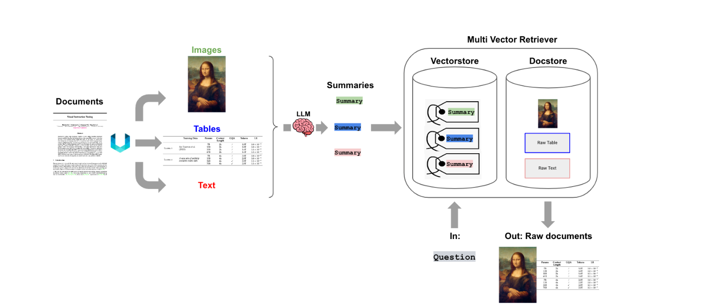

# Multimodal Retrieval-Augmented Generation - Chat with Financial Documents using LangChain, GPT4o Multimodal LLM & ChromDB

This project allows users to interact with PDF documents containing images, text, and tables through a Question & Answer (Q&A) interface. The solution involves extracting content from PDFs, generating summaries, and using a Retrieval-Augmented Generation (RAG) pipeline to provide relevant responses to user queries.

## Table of Contents
- [Project Overview](#project-overview)
- [Architecture](#architecture)
- [Prerequisites](#prerequisites)
- [Installation](#installation)
- [Usage](#usage)
- [File Structure](#file-structure)
- [Contact](#contact)

## Project Overview

The project extracts images, text, and tables from PDF documents and generates summaries using a large language model (LLM). These summaries are stored in a vector store, while the raw documents are stored in a doc store. The system uses a Multi-Vector Retriever to fetch relevant documents based on user queries, and an LLM generates answers using the retrieved documents as context.

## Architecture



1. **Extraction**: 
    - Uses the `unstructured` library to extract images, text, and tables from PDFs.
    - `YOLOX` is employed to detect elements in the document.

2. **Summarization**: 
    - GPT-4.0 Multimodal model generates summaries for the extracted content.

3. **Storage (ChromaDB)**: 
    - Summaries are stored in a vector store.
    - Raw documents are stored in a doc store.

4. **Retrieval-Augmented Generation (RAG) Pipeline**: 
    - User queries are processed to retrieve the most relevant documents.
    - The context from these documents is used by the GPT-4.0 Multimodal LLM to generate responses.

## Prerequisites

- Python 3.11+
- Jupyter Notebook
- Necessary Python packages (listed in `requirements.txt`)

## Installation

1. **Clone the Repository**:
    ```sh
    git clone https://github.com/subham0/chat-with-pdfs-langchain.git
    cd <chat-with-pdfs-langchain>
    ```

2. **Install Dependencies**:
    ```sh
    pip install -r requirements.txt
    ```

## Usage

1. **Extract Content from PDF**:
    - Place your PDF files in the designated directory.
    - Run the Jupyter Notebook to extract images, text, and tables.

2. **Generate Summaries**:
    - Use the provided notebook cells to generate summaries for the extracted content.

3. **Store Summaries and Raw Documents**:
    - The notebook includes cells to store summaries in ChromaDB and raw documents in the doc store.

4. **Query the System**:
    - Use the implemented RAG pipeline to input user queries and retrieve relevant documents and answers.

## File Structure

project-root/
│
├── Chat_With_Financial_Documents.ipynb # Jupyter Notebook containing the code and walkthrough
├── requirements.txt # List of required packages
├── RAG_Architecture.png # Architecture diagram
├── TSLA-Q3-2023-Update-3.pdf # Example PDF document
├── ".xlsx" # All Tables extracted from PDF
└── TSLA-Q3-2023-Update-3_yolox_150/
├── images/ # Folder containing extracted images from PDF


## Contact

For any questions or support, please contact - 

- **Name**: Subham Gupta
- **Email**: subhuwin@gmail.com
- **GitHub**: [subham0](https://github.com/subham0)
